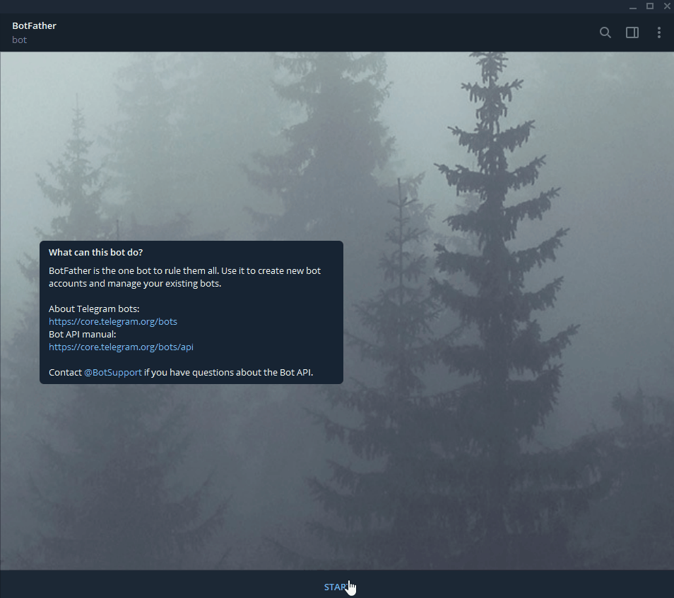
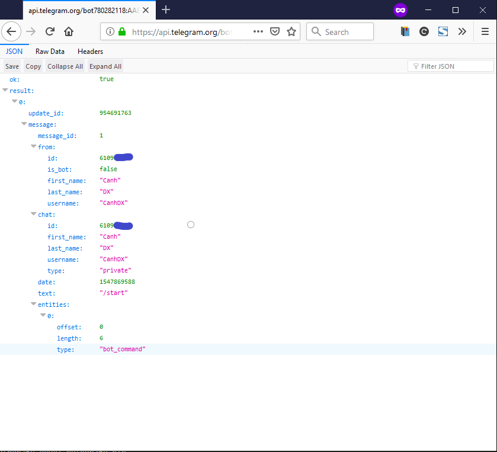
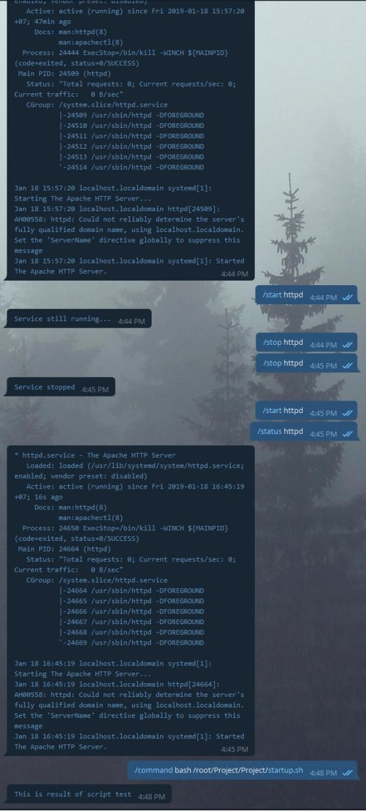

# Tools cho phép tạo mới 1 bot Telelegram có thể thực hiện các lệnh Start, Stop, Restart các Service trên Server Linux

## Tính năng 
- Cho phép restart, stop, start service đang running trên Server
- Limit danh sách user có thể thao tác
- Advance: Có thể thực hiện các câu lệnh của linux khi tương tác với telegram_bot

## Cách sử dụng 
### 1. Create và lấy API bot

- Chat với `@BotFather` để lấy token
    ```sh
    /start
    /newbot
    {your_bot_name}
    {your_bot_name}_bot
    ```

    

- Lấy ID của user thao tác với bot (Nhằm xác thực)
    + Truy cập đường dẫn 
        ```sh
        https://api.telegram.org/bot{TOKEN}/getUpdates
        ```

    + Thực hiện thao tác chat với bot để lấy id user

        

Sau khi lấy được Token và User_id thì tiến hành cài đặt bot

### 2. Cài đặt môi trường

Yêu cầu python3.6 và chạy với venv (Phía dưới là hướng dẫn chạy trên CentOS7)

Cài đặt python3.6
- Thêm Repo 
    ```sh 
    sudo yum install -y https://centos7.iuscommunity.org/ius-release.rpm
    ```

- Update để cập nhật repo mới 
    ```sh 
    sudo yum update
    ```

- Download và cài đặt python36
    ```sh 
    sudo yum install -y python36u python36u-libs python36u-devel python36u-pip
    ```

Cài đặt Virtual Environment
- Cài đặt pip
    ```sh 
    yum install wget -y
    wget https://bootstrap.pypa.io/get-pip.py
    sudo python3.6 get-pip.py
    ```

- Cài đặt venv
    ```sh 
    sudo pip3.6 install virtualenv
    ```

- Tạo môi trường riêng cho ứng dụng 
    ```sh 
    mkdir Project
    cd Project
    virtualenv venv -p python3.6
    source venv/bin/activate
    ```

### 3. Download sourcode và cài đặt requirement

- Clone bot về source về
    ```sh
    yum install git -y
    git clone http://github.com/nhanhoadocs/telegrambot-exec-command.git 
    ```

- Cài đặt requirement packet 
    ```sh
    cd telegrambot-exec-command
    pip install -r requirement.txt
    ```
- Cấu hình cho trong file `setting.ini`
    ```sh 
    TOKEN = {token của bot}
    # Cho phep thuc hien stop/start/restart
    chat_id_normal = {userid1},{userid2}
    # Cho phep thuc hien chay command dac biet
    chat_id_special = {userid2},{userid3}
    ```

### 4. Cài đặt Supervisor để quản lý bot, giữ bot luôn hoạt động 

- Cài đặt 
    ```sh 
    yum install supervisor -y 
    ```

- Cấu hình Supervisord
    ```sh 
    cat << EOF >> /etc/supervisord.d/telebot.ini
    [program:telebot]
    command = /root/Project/venv/bin/python /root/Project/telegrambot-exec-command/telebot.py
    autostart=true
    autorestart=true
    startrereies=5
    stderr_logfile=/var/log/supervisor/telebot.log
    stdout_logfile=/var/log/supervisor/telebot.err.log
    EOF
    ```

- Start Supervisord để khởi chạy bot
    ```sh 
    systemctl start supervisord
    ```

- Kiểm tra bot running 
    ```sh 
    supervisorctl
    ```

    Kết quả như sau là bot đang running 
    ```sh 
    [root@localhost ~]# supervisorctl
    telebot                          RUNNING   pid 25840, uptime 0:00:06
    supervisor>
    ```

- Chúng ta có thể thao tác stop/start bot như sau 
    ```sh 
    supervisor> stop telebot
    telebot: stopped
    supervisor> status telebot
    telebot                          STOPPED   Jan 19 11:29 AM
    supervisor> start telebot
    telebot: started
    supervisor> status
    telebot                          RUNNING   pid 25850, uptime 0:00:11
    supervisor> exit
    ```

- Để kiểm tra bot running tiến hành thao tác với bot 

    

## Hoàn tất
